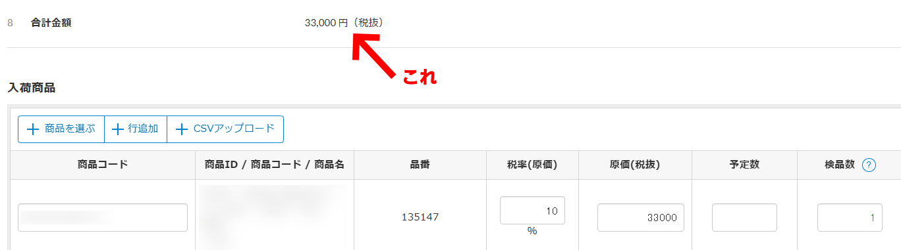
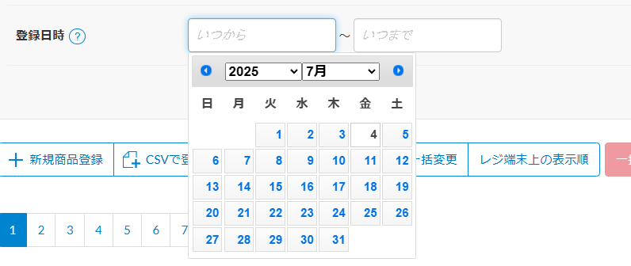

### スクリプト詳細
> **▼ 入荷登録画面 合計金額表示スクリプト**（スマレジ用）  
> inbound_entry_sum_show.js

  
 

> **▼ 入荷データ参照画面 合計金額計算スクリプト**（スマレジ用）  
> inbound_data_total_calc.js
 

> **▼ スマレジ - 商品管理ページにDatepicker導入**（スマレジ用）  
> smaregi_item_datepicker.js

  
 
